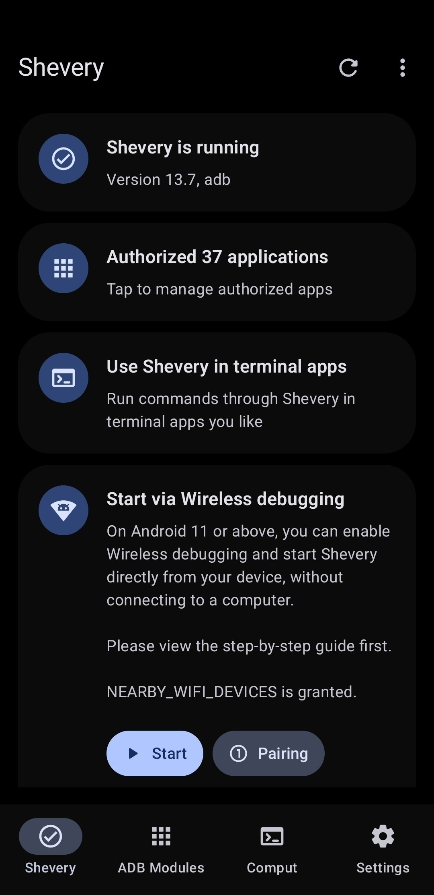
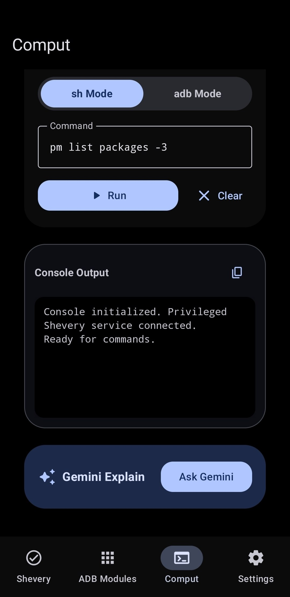
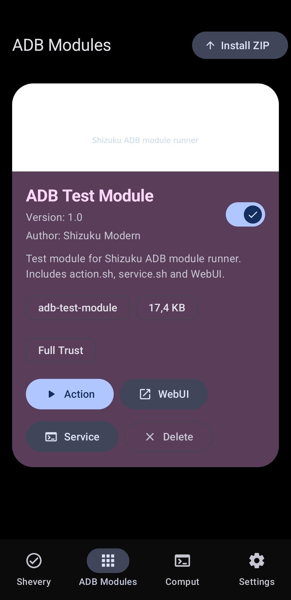
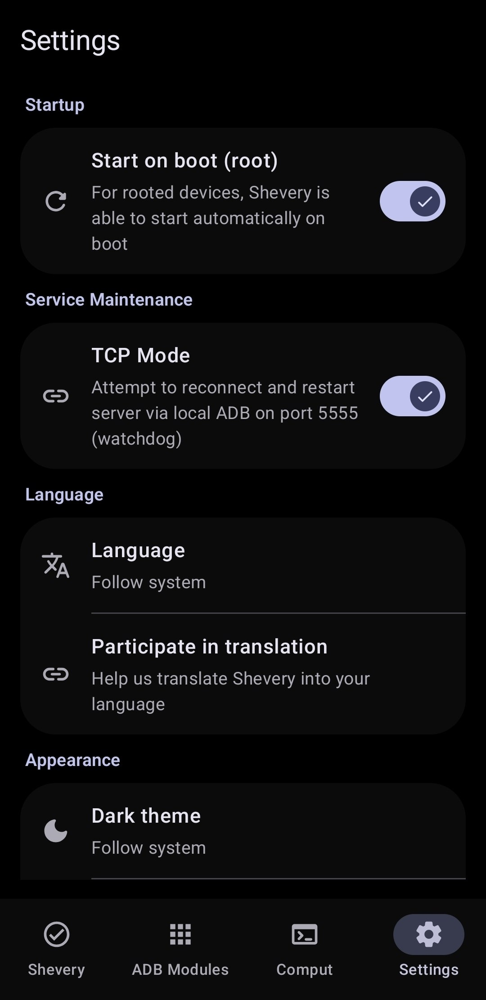

# Shevery

## Fork status

> [!IMPORTANT]
> **Migration Action Required:** Due to the App Signation (moe.shizuku.privileged.api->**com.hamondev.shevery**), you **MUST UNINSTALL** any older official Shizuku Manager app from your device before installing Shevery. Otherwise, they will conflict.
Upstream project reference: <https://github.com/RikkaApps/Shizuku>
> 

## Fork additions

- Jetpack Compose manager UI with Material 3 Expressive components, motion, switches, and rounded icon treatment.
- **Dhizuku Experimental Support**: Dedicated Device-Owner bridging system available inside Laboratory features.
- **Better shell/adb based "Comput"** feature with Gemini Explaination.
- Android 16/17 target work with current preview SDK/build tooling in this fork.
- ADB Modules screen for installing and managing ZIP modules.
- Module features: `module.prop`, banner, enable/disable switch, `action.sh`, policy-gated `service.sh`, local WebUI, delete, path checks, size limits, output limits, and last-run logs.
- Module policy settings: Safe mode, Full access, and background action control.
- Debug test module under `test-modules/adb-test-module.zip`.

## Documentation

- [ADB Modules guide](docs/adb-modules-guide.md)
- [ADB Modules API reference](docs/adb-modules-api.md)
- [Shizuku Connectors API](docs/shizuku-connectors.md)
- [Android 17 Compatibility](docs/android-17-compatibility.md)

## Background

When developing apps that requires root, the most common method is to run some commands in the su shell. For example, there is an app that uses the `pm enable/disable` command to enable/disable components.

This method has very big disadvantages:

1. **Extremely slow** (Multiple process creation)
2. Needs to process texts (**Super unreliable**)
3. The possibility is limited to available commands
4. Even if ADB has sufficient permissions, the app requires root privileges to run

Shizuku uses a completely different way. See detailed description below.

## User guide & Download

<https://shizuku.rikka.app/>

## Screenshots

  
📸 Click to open Screenshot Gallery

   
  <table>
    <tr>
      <td align="center"> <b>Main Screen</b></td>
      <td align="center"> <b>Comput Console</b></td>
    </tr>
    <tr>
      <td align="center"> <b>ADB Modules</b></td>
      <td align="center"> <b>Settings</b></td>
    </tr>
  </table>

## How does Shizuku work?

First, we need to talk about how app use system APIs. For example, if the app wants to get installed apps, we all know we should use `PackageManager#getInstalledPackages()`. This is actually an interprocess communication (IPC) process of the app process and system server process, just the Android framework did the inner works for us.

Android uses `binder` to do this type of IPC. `Binder` allows the server-side to learn the uid and pid of the client-side, so that the system server can check if the app has the permission to do the operation.

Usually, if there is a "manager" (e.g., `PackageManager`) for apps to use, there should be a "service" (e.g., `PackageManagerService`) in the system server process. We can simply think if the app holds the `binder` of the "service", it can communicate with the "service". The app process will receive binders of system services on start.

Shizuku guides users to run a process, Shizuku server, with root or ADB first. When the app starts, the `binder` to Shizuku server will also be sent to the app.

The most important feature Shizuku provides is something like be a middle man to receive requests from the app, sent them to the system server, and send back the results. You can see the `transactRemote` method in `rikka.shizuku.server.ShizukuService` class, and `moe.shizuku.api.ShizukuBinderWrapper` class for the detail.

So, we reached our goal, to use system APIs with higher permission. And to the app, it is almost identical to the use of system APIs directly.

## Developer guide

### API & sample

https://github.com/RikkaApps/Shizuku-API

### Migrating from pre-v11

> Existing applications still works, of course.

https://github.com/RikkaApps/Shizuku-API#migration-guide-for-existing-applications-use-shizuku-pre-v11

### Attention

1. ADB permissions are limited

   ADB has limited permissions and different on various system versions. You can see permissions granted to ADB [here](https://github.com/aosp-mirror/platform_frameworks_base/blob/master/packages/Shell/AndroidManifest.xml).

   Before calling the API, you can use `ShizukuService#getUid` to check if Shizuku is running user ADB, or use `ShizukuService#checkPermission` to check if the server has sufficient permissions.

2. Hidden API limitation from Android 9

   As of Android 9, the usage of the hidden APIs is limited for normal apps. Please use other methods (such as <https://github.com/LSPosed/AndroidHiddenApiBypass>).

3. Android 8.0 & ADB

   At present, the way Shizuku service gets the app process is to combine `IActivityManager#registerProcessObserver` and `IActivityManager#registerUidObserver` (26+) to ensure that the app process will be sent when the app starts. However, on API 26, ADB lacks permissions to use `registerUidObserver`, so if you need to use Shizuku in a process that might not be started by an Activity, it is recommended to trigger the send binder by starting a transparent activity.

4. Direct use of `transactRemote` requires attention

   * The API may be different under different Android versions, please be sure to check it carefully. Also, the `android.app.IActivityManager` has the aidl form in API 26 and later, and `android.app.IActivityManager$Stub` exists only on API 26.

   * `SystemServiceHelper.getTransactionCode` may not get the correct transaction code, such as `android.content.pm.IPackageManager$Stub.TRANSACTION_getInstalledPackages` does not exist on API 25 and there is `android.content.pm.IPackageManager$Stub.TRANSACTION_getInstalledPackages_47` (this situation has been dealt with, but it is not excluded that there may be other circumstances). This problem is not encountered with the `ShizukuBinderWrapper` method.

## Developing Shizuku itself

### Build

- Clone with `git clone --recurse-submodules`
- Run gradle task `:manager:assembleDebug` or `:manager:assembleRelease`

The `:manager:assembleDebug` task generates a debuggable server. You can attach a debugger to `shizuku_server` to debug the server. Be aware that, in Android Studio, "Run/Debug configurations" - "Always install with package manager" should be checked, so that the server will use the latest code.

## License

All code files in this project are licensed under Apache 2.0

Under Apache 2.0 section 6, specifically:

* You are **FORBIDDEN** to use `manager/src/main/res/mipmap*/ic_launcher*.png` image files, unless for displaying Shizuku itself.

* You are **FORBIDDEN** to use `Shizuku` as app name or use `moe.shizuku.privileged.api` as application id or declare `moe.shizuku.manager.permission.*` permission.

## Credits

* [Nightzuku](https://github.com/kerneldroid/Nightzuku) - for parts of App UI and Android 17 support.
* [Shizuku](https://github.com/rikkaapps/Shizuku) - for Shizuku API and main sources.
